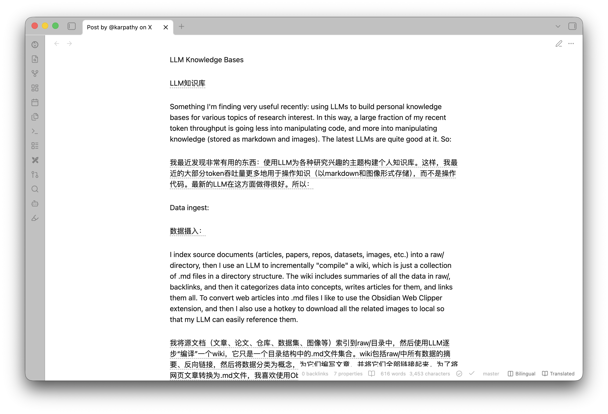

<h1 align="center">Interlinear</h1>

<p align="center">
  Reading-mode interlinear translation for <a href="https://obsidian.md">Obsidian</a>
</p>

<p align="center">
  <strong>English</strong> ·
  <a href="https://github.com/linyp/obsidian-interlinear/blob/main/README.zh-CN.md">简体中文</a> ·
  <a href="https://github.com/linyp/obsidian-interlinear/blob/main/README.ja.md">日本語</a> ·
  <a href="https://github.com/linyp/obsidian-interlinear/blob/main/README.ko.md">한국어</a> ·
  <a href="https://github.com/linyp/obsidian-interlinear/blob/main/README.vi.md">Tiếng Việt</a>
</p>

<p align="center">
  
</p>

Reading-mode **interlinear translation** for [Obsidian](https://obsidian.md). Open a
foreign-language note in reading view, click one button, and Interlinear renders a
Chinese (or any target language) translation **alongside** the original — paragraph
by paragraph, as bilingual or translation-only.

## Why it's safe by design

- **Never modifies your notes.** Translations are injected as render-layer DOM only;
  the registered Markdown post-processor is a network-free boundary, while the DOM
  adapter handles Obsidian's virtualized reading view. Close and reopen the note and
  the file on disk is byte-for-byte unchanged.
- **Never auto-translates.** Opening/switching notes, layout changes, scrolling, and
  settings changes never send a translation request. Translation runs **only** when
  you explicitly click the floating / status-bar button (or run the command).
- **BYOK, zero telemetry.** Your credentials live only in vault-local plugin
  settings files: `data.json` and, after a settings migration, the one-time
  `data.backup.json` (both ignored by this repository). They are never hard-coded,
  never logged, and never sent anywhere except to the translation endpoint you configure.
- **Reading view only** (MVP). No edit/Live-Preview translation.

## Features

- **One-click whole-note translation**, triggered from either surface:
  - the **floating button** in the lower-right of the reading view — the entry
    point on **mobile** (which has no status bar), optional on desktop;
  - the **status-bar buttons** (desktop) or the command palette.
  Both show live batch progress (`3/12`) while translating. Click again to toggle
  **translation ↔ original** (a CSS class swap — no new requests).
- **Two display modes** — **bilingual** (original + translation) ↔
  **translation-only** — switched instantly with no re-translation. In
  translation-only mode, **hover a translation (or tap it on mobile) to peek at
  its original** inline.
- **Five translation styles** (pure CSS, switchable live): border, quote block,
  muted text, dashed underline, and a **learning mask** that blurs translations
  until you hover — for language practice.
- **Persistent translation cache** — content-hash keyed, LRU-capped, saved as
  `cache.json` in the plugin folder. Reopening a note after a restart costs
  nothing; only hashes and translations are stored, never your source text.
- **Whole-note translation, virtualization-aware.** Obsidian's reading view only
  keeps on-screen blocks in the live DOM, so one click translates the visible
  blocks immediately, pre-translates the rest into the cache, and a
  `MutationObserver` injects cached translations into each block the instant it
  renders as you scroll.
- **Skips what shouldn't be translated:** code blocks, math, image-only blocks,
  bare URLs, pure symbol/number blocks, and blocks safely recognized as already in
  a distinctive-script target language (`zh`, `ja`, `ko`, `th`, `he`, or `el`).
  Shared-script targets such as English or Vietnamese are translated conservatively
  because a script alone cannot distinguish languages that use the same alphabet.
- **Pluggable backend** behind a `TranslationProvider` interface, with **service
  presets** across two families and a **Test connection** button in settings:
  - **LLM** (default): DeepSeek, OpenAI, SiliconFlow, Ollama, or any custom
    OpenAI-compatible endpoint;
  - **Traditional machine translation**: Baidu Translate (百度翻译) and
    Youdao (有道智云) — cheaper/faster APIs with generous free tiers; each
    keeps its own credentials, so switching services never loses keys.
  Requests use Obsidian's `requestUrl` (not `fetch`).

## Network use, accounts & privacy

- **Remote service.** When — and only when — you trigger a translation or click
  **Test connection**, the plugin sends the translatable paragraph text of the
  active note to the active LLM preset's configured endpoint (default
  `https://api.deepseek.com`) or, for traditional MT, that service's fixed official
  API endpoint. Nothing is sent at any other time, and never to more than one service.
- **Account required.** Bring your own API key / app credentials (BYOK) for the
  selected service; usage is billed by that provider, not by this plugin.
- **No telemetry.** The plugin collects nothing and phones home nowhere.
- **Local files only.** Settings (including credentials) live in the plugin's
  `data.json`. A one-time pre-migration copy may live in `data.backup.json`; the
  translation cache lives in `cache.json` next to them (content hashes +
  translations only). Your notes are never modified.
- **Syncing caveat.** These settings files sit inside your vault, so vault sync
  (Obsidian Sync, iCloud, Dropbox, …) carries credentials to every synced device.
  If you keep your vault in a git repository, add both
  `.obsidian/plugins/interlinear/data.json` and
  `.obsidian/plugins/interlinear/data.backup.json` to that vault's `.gitignore`
  so credentials are never committed.

## Install

### From Obsidian (recommended)

1. Open **Settings → Community plugins → Browse**.
2. Search for **Interlinear**, then select **Install** and **Enable**.

Or open the [plugin's directory page](https://obsidian.md/plugins?id=interlinear)
in a browser and click **Install**.

Updates arrive through Obsidian's plugin update flow — **Settings → Community
plugins → Check for updates**.

### Upgrading to v0.3.0 from v0.2.5

v0.3.0 uses settings schema v2. It migrates v0.2.5's flat settings once and
preserves the original data in `data.backup.json` before rewriting `data.json`.

If you sync plugin settings, update Interlinear on **every synced device before
changing its settings on any device**. Running mixed plugin versions and
downgrading after the migration are not supported.

### Via BRAT (early / beta builds)

To track the latest GitHub release before it reaches the directory:

1. Install and enable **[BRAT](https://github.com/TfTHacker/obsidian42-brat)**
   from **Settings → Community plugins → Browse** (search "BRAT").
2. Run the command **BRAT: Add a beta plugin for testing**.
3. Enter the repository `linyp/obsidian-interlinear` and confirm.
4. Enable **Interlinear** in **Settings → Community plugins**.

### Manual

1. Download `main.js`, `manifest.json`, and `styles.css` from the
   [latest release](https://github.com/linyp/obsidian-interlinear/releases/latest).
2. Put the three files in `<your-vault>/.obsidian/plugins/interlinear/`.
3. Enable **Interlinear** in **Settings → Community plugins**.

(To build from source instead, see [Develop](#develop).)

## Configure

Open **Settings → Interlinear**:

| Setting | Default | Notes |
| --- | --- | --- |
| Service | DeepSeek | One dropdown, two families. **LLM**: DeepSeek / OpenAI / SiliconFlow / Ollama / custom OpenAI-compatible. **Traditional MT**: Baidu Translate (百度翻译) / Youdao (有道智云). Each preset keeps its own credentials and Advanced tuning; LLM presets additionally keep their endpoint/model and custom instructions. The first selection initializes that preset's recommended defaults; later selections restore its saved values. |
| API key _(LLM only)_ | _(empty)_ | Required (BYOK). Stored only in local plugin settings files. |
| App ID + secret _(Baidu / Youdao)_ | _(empty)_ | The app credential pair from that service's developer console (BYOK, same storage rules). |
| Base URL _(LLM only)_ | `https://api.deepseek.com` | Any OpenAI-compatible endpoint. |
| Model _(LLM only)_ | `deepseek-v4-flash` | |
| Test connection | — | Sends one tiny request to verify the credentials and endpoint. |
| Target language | `zh-CN` | First-class presets include `zh-CN`, `zh-TW`, `en`, `ja`, `ko`, `vi`, and more; custom BCP-47-style codes are also accepted. |
| Default display mode | Bilingual | |
| Translation style | Border | Border / quote / muted / dashed underline / learning mask. |
| Floating button | Mobile only | Always / mobile only / never. |
| Concurrency | 10 | Max in-flight requests (1–16). |
| Min interval (ms) | 0 | Spacing between request starts. |
| Max retries | 3 | On 429 / transient errors. |
| Batch char budget | 4000 | Characters packed per request. |
| Max segments per request | 12 | Blocks packed per request, alongside the char budget (1–100). Traditional MT services additionally enforce their own hard per-request caps. |
| Custom instructions _(LLM only)_ | _(empty)_ | Optional text appended to the system prompt — glossary, tone, or domain. Non-empty instructions are part of the cache identity, so changing them takes effect on the next explicit translation. |
| Persistent cache | On | Keep translations across restarts; shows size and offers one-click clear. |

> DeepSeek's flash tier rate-limits by **concurrent connections**, not by RPM/TPM,
> so the defaults run several requests in parallel with no spacing. Selecting
> another preset applies a more conservative tuning (lower concurrency + request
> spacing for RPM/TPM-limited services like OpenAI/SiliconFlow; small batches for
> a local Ollama model). Baidu's basic text translation is free once you complete
> personal verification (个人认证): the Advanced plan allows 10 requests/second
> with 1M free characters/month, and the preset paces requests to stay under that
> (~150 ms spacing, one paragraph per request). On an unverified Baidu account
> (~1 request/second) raise **Min interval** to ~1100 ms. Youdao's docs publish
> no QPS number, but its console assigns each app a QPS quota that is low in
> practice, so the Youdao preset runs strictly serial with ≥1.1 s spacing —
> lower **Min interval** only if your app's quota allows it (411/412 errors
> mean it doesn't).
>
> Traditional MT services also enforce hard per-request caps on top of your batch
> settings (the smaller value wins): Baidu 1 text / ~1 800 chars; Youdao 1 text /
> ~4 500 chars. **Concurrency / Min interval / Max retries** apply to every
> service; **Custom instructions** is LLM-only (traditional MT has no prompt) and
> is hidden for those services. A single paragraph larger than a service's
> per-request limit fails server-side and is surfaced as a failed batch — the
> notice includes the reason, and triggering again retries.

## Use

1. Open a note and switch to **reading view**.
2. Click **Translate** in the status bar (desktop) or the **floating button**
   in the lower-right (mobile). It collects the translatable paragraphs,
   translates the whole note, and shows live progress while batches are in
   flight.
3. Click again to toggle the **translation ↔ original**.
4. Use the small **mode** button (or the status-bar one) to toggle
   **bilingual ↔ translation-only** (instant — no new requests). In
   translation-only mode, hover (desktop) or tap (mobile) a translation to peek
   at its original.

Commands (Command Palette, shown under the **Interlinear:** prefix). No default
hotkey is set (per community guidelines) — bind your own under
**Settings → Hotkeys**:

- **Translate / show original** — translate the note, or toggle
  translation ↔ original once translated. Re-running is idempotent: cached blocks
  are reused, so it also retries any batches that failed.
- **Toggle display mode (bilingual / translation-only)**
- **Clear translations**

## Develop

Point the build output straight at a **test vault** (use a throwaway vault, not
your daily one) via an environment variable, and rebuild on save:

```bash
INTERLINEAR_OUTDIR="/path/to/test-vault/.obsidian/plugins/interlinear" npm run dev
```

`npm run dev` runs esbuild in watch mode with inline sourcemaps and copies
`manifest.json`, `styles.css`, and `.hotreload` next to `main.js`. Install pjeby's
**Hot Reload** plugin in the test vault and the `.hotreload` marker makes it
auto-reload on every rebuild. (Reading-mode rendering only re-runs when you toggle
edit ↔ reading or reopen the note.)

Useful scripts:

```bash
npm run build      # tsc --noEmit + production bundle -> main.js
npm run typecheck  # tsc --noEmit
npm test           # vitest run
npm run test:watch # vitest (watch)
```

### Release

```bash
npm version patch|minor|major  # syncs package.json, manifest.json, versions.json
git push && git push --tags
```

Pushing the tag triggers the GitHub Actions workflow, which tests, builds, and
creates a **draft** release with `main.js` / `manifest.json` / `styles.css`
attached as individual assets — review the draft, then publish.

## Architecture

The hard part of this plugin is that its UI/rendering can only be verified inside
Obsidian, so the design pushes **all decidable logic into pure, tested modules**
and keeps the Obsidian/DOM/network surface thin.

```
src/
  core/         pure logic (no obsidian): hash, segmentation + batch pack/unpack,
                block skip-rules + same-language detection, rate limiter
                (concurrency/backoff), MD5/SHA-256 signing helpers
                (Baidu/Youdao), list-markdown reassembly for translated lists
  translator/   provider.ts (interface + typed errors + shared HTTP helpers),
                one pure request-builder/response-parser module per backend
                (deepseek.ts, baidu.ts, youdao.ts),
                factory.ts (settings -> provider), langCodes.ts (per-service
                target-language mapping), cache.ts (LRU + serialization),
                cachePersistence.ts (cache.json load/write/remove in the plugin
                folder only);
                requestUrlClient.ts is the only requestUrl adapter
  render/       postProcessor.ts — DOM adapter + collect/inject/clear/display-mode
                + style helpers
  ui/           translateButton.ts (status bar + FAB + translation flow),
                settingsTab.ts
  settings.ts   pure settings types + defaults + schema migration + normalize/validate
  main.ts       composition root
```

Pure logic modules never depend on the `obsidian` runtime (a types-only package).
The thin runtime shells are tested with an Obsidian stub and a lightweight DOM;
providers use an injectable `HttpClient`, so their real request/parse paths are
tested without contacting the network. DOM collection/injection, explicit-trigger
controller behavior, the `requestUrl` adapter, and cache persistence also have
focused tests.

On the LLM path, batches are packed with numbered `<<<SEG k>>>` sentinels. Every
`provider.translate()` call makes exactly one HTTP request; if the model returns
the wrong segment count, that batch fails visibly and can be retried by the next
explicit Translate action. Traditional MT APIs take one text per request —
inherently 1:1 — so they skip the sentinel protocol entirely; each provider
declares its hard per-request caps and the controller sizes batches to fit.

Want another backend? Adding one is deliberately small: a pure
request-builder/response-parser module in `src/translator/` (see `baidu.ts` /
`youdao.ts` for the pattern — no `obsidian` imports, HTTP injected so it's
unit-testable), a case in `factory.ts`, a preset in `settings.ts`, and a
credentials row in the settings tab. PRs welcome!

## Limitations (MVP)

- Reading view only — no editing/Live-Preview translation.
- Lists and tables are translated as a single block (best-effort). A flat
  list's translation is re-rendered as a list; nested structure is not
  reconstructed.

## License

MIT
